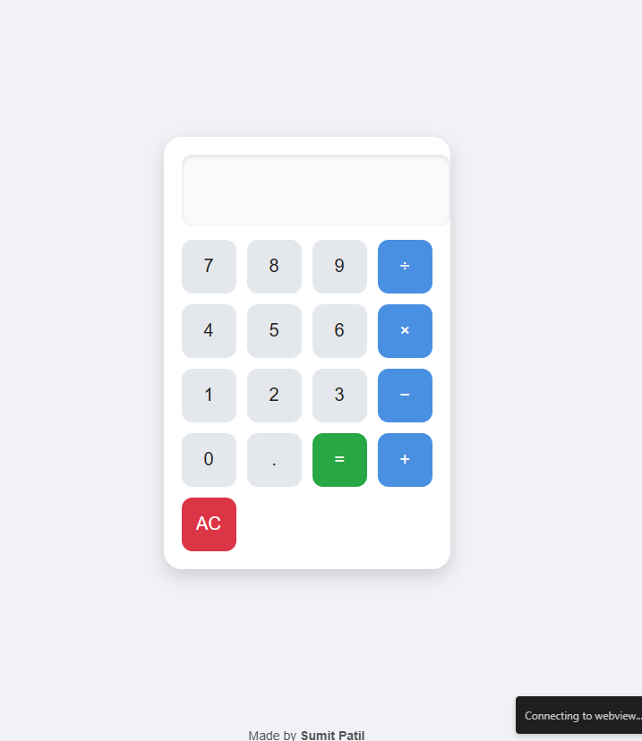

Here’s a ready-to-use **`README.md`** file for your **Prank Calculator** project:

---

````markdown
# 🎉 Prank Calculator 🤡

  
*A fun little prank calculator that looks professional… until you actually try to use it!*  

---

## ✨ Features
- ✅ Looks like a real calculator 🧮  
- 🔔 Plays funny sounds when you press buttons  
- 🤭 Shows hilarious messages like **"main nahi bataunga"** and **"mere se nhi hoga"**  
- 🎵 Plays a prank song when certain inputs are entered  
- ❌ Disables the `=` button when you enter 4+ digits  

---

## 📸 Demo Screenshot


---

## 🚀 How to Use
1. Clone or download this repo  
   ```bash
   git clone https://github.com/your-username/prank-calculator.git
````

2. Open `index.html` in your browser 🌐
3. Start typing numbers and enjoy the chaos 😆

---

## 🛠️ Tech Stack

* ⚡ HTML

---

## 👤 Author

Made with ❤️ by **Sumit Shingne**


